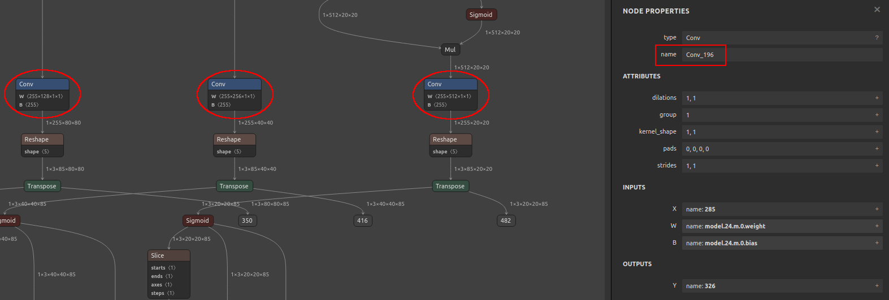

# yolo-v3v5-in-Openvino
This is a repository containing a workflow for the conversion of Yolov3 and Yolov5 from Pytorch to Openvino over ONNX and bounding box evaluation of the network

# YOLOV5

Yolov5 is supported by the Openvino Toolkit. This means it can be converted and executed on platforms running Openvino such as Intel CPUs and the Intel Neural Compute Stick 2 (NCS2). In this guide, the necessary reposities are shown and various steps are documented for future reference.


## Used Repositories
Oficial yolov5 repository: https://github.com/ultralytics/yolov5

A yolov5 on Openvino demo repository: https://github.com/violet17/yolov5_demo.git

```console
# input the following commands in your console session
git clone https://github.com/ultralytics/yolov5.git
git clone https://github.com/violet17/yolov5_demo.git
```

## Virtual Environment
It is recommended to work with a python virtual environment to avoid version conflicts between pip packages.

```console
cd yolov5 # navigate to the cloned yolov5 ultralytics repo
python3 -m venv venv_yolov5 # this creates an empty virtual environment
source venv_yolov5/bin/activate # activate the environment
# now update the basic pip packages
pip3 install --upgrade pip setuptools
# install all necessary tools for the conversion to onnx
pip3 install -r requirements.txt
# and finally some packages for the Openvino conversion script
pip3 install networkx defusedxml progress
```

## ONNX Export

The original model was developed in Pytorch. To convert the model to Openvino, we need to first convert the model from Pytorch to ONNX. The next command shoudĺd generate a yolov5s.onnx model in the models folder

```console
python3 export.py --weights models/yolov5s.pt --include onnx --simplify
```

## ONNX to Openvino
Now we have to convert the ONNX yolv5s into Openvino IR format.
Please consult this website: https://docs.openvino.ai/latest/openvino_docs_install_guides_installing_openvino_linux.html on how to install and activate the Openvino Toolkit for Linux.

After the successful installation of Openvino under /opt/intel/openvino_$version$ we can convert the ONNX model to IR. There is a slight catch here. The output convolution layers which need to be specified for the later steps to work, can be called differently from what is used in this guide. To figure out the correct names we can use Netron - a powerful Neural Network visualization tool - under: https://netron.app/.
Drag and drop the yolov5s.onnx model into the browser window. Scroll down to where the three output nodes for different scales are. There you should find nodes similar to what is shown in the picture below.
<div align="center">
  
</div>
Click on each of the last convolution layers before the output nodes and note the names. The names can be seen in the red rectangle on the right. These names can be parsed to the output flag of the mo.py Openvino conversion script as a comma separated list.

```console
python3 /opt/intel/openvino_2021.4.689/deployment_tools/model_optimizer/mo.py \
--input_model models/yolov5s.onnx \
--output_dir models/ \
--input_shape [1,3,640,640] \
--input images \
--scale 255 \
--data_type FP16 \
--output Conv_196,Conv_250,Conv_304 \
--model_name yolov5s_FP16 \
--progress
```

Now the models folder should contain three more files:
* yolov5s_FP16.bin
* yolov5s_FP16.xml
* yolov5s_FP16.mapping

It is possible to drag and drop the XML file into Netron to check if the outputs were correctly chosen.
Adjust the flags according to your needs. The parameter --scale 255 should not be touched, as it can lead to inaccuracies in the resulting model, during the execution on the NCS2.

## Model execution on Hardware

Now we can try the models in different frameworks and on different devices. Lets start with the simplified ONNX model.

```console
# run detect to try out the model; also accepts images as input; cam for webcam
python3 detect.py --source cam --device cpu --view-img --nosave
```

We can see if the model can be executed on the NCS2 with the help of the benchmark_app from the Openvino framework.

```console
python3 /opt/intel/openvino_2021.4.689/deployment_tools/tools/benchmark_tool/benchmark_app.py \
--path_to_model models/yolov5_simpl_FP16.xml \
-niter 10 \ # number of execution iterations
-nireq 1 \ # number of inference requests
-d MYRIAD # change to CPU to run model on the CPU
```

Finally, to look at the detection results, we can use the yolov5_demo.git repository. Download the coco labels from: https://github.com/amikelive/coco-labels/blob/master/coco-labels-2014_2017.txt

```console
cd ../yolov5_demo/
wget https://raw.githubusercontent.com/amikelive/coco-labels/master/coco-labels-2014_2017.txt
```

Now run the demo script with parameters of your choosing.

```console
python3 yolov5_demo_OV2021.3.py \
--input cam \
--model ../yolov5/models/yolov5s_simpl_FP16.xml \
-d MYRIAD \ # or CPU
--labels coco-labels-2014_2017.txt \
-t 0.5
```

This script outputs the inference time and the identified objects in the yolo format.

```console
Starting inference for picture:picture.jpg
Inference time: 260.003 ms
...
{'xmin': 3028, 'xmax': 4543, 'ymin': 365, 'ymax': 3433, 'class_id': 0, 'confidence': 0.9043130874633789}
```

## Yolov3 Compatibility

The execution and evaluation in this guide were also tested on Yolov3 and Yolov3-tiny. The conversion process for Yolov3 is described on the official Openvino page: https://docs.openvino.ai/latest/openvino_docs_MO_DG_prepare_model_convert_model_tf_specific_Convert_YOLO_From_Tensorflow.html

## Versions

This guide was updated on the 25.11.2021 using the following software versions:
* Openvino: 2021.4.689
* Pytorch: 1.10.0
* ONNX: 1.10.2
* Tensorboard: 2.7.0
* Opencv-python: 4.5.4.58
* Numpy: 1.19.5

## Embedded Machine Learning Laboratory

This repository is part of the Embedded Machine Learning Laboratory at the TU Wien. For more useful guides and various scripts for many different platforms visit our **Scripts and Guides Github Repository**: **https://github.com/embedded-machine-learning/scripts-and-guides**

Our newest projects can be viewed on our **webpage**: **https://eml.ict.tuwien.ac.at/**
